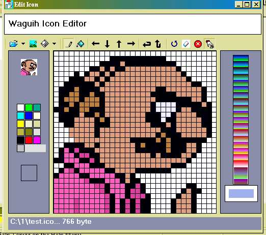



## Easy 32x32 Icon Editor

### Description

convert BMP to icon, Extract Icon From exe Files,

edit and modify existing Icons, change Icon Background,

... and much more
 
### More Info
 
cmoponents: Microsoft Window Common Controls,

Microsoft Common Dialog Control

             |
---                |---
**Submitted On**   |2007-05-23 00:17:02
**By**             |[Waguih Youssef Sami](https://github.com/Planet-Source-Code/PSCIndex/blob/master/ByAuthor/waguih-youssef-sami.md)
**Level**          |Intermediate
**User Rating**    |4.8 (24 globes from 5 users)
**Compatibility**  |VB 5\.0, VB 6\.0
**Category**       |[Complete Applications](https://github.com/Planet-Source-Code/PSCIndex/blob/master/ByCategory/complete-applications__1-27.md)
**World**          |[Visual Basic](https://github.com/Planet-Source-Code/PSCIndex/blob/master/ByWorld/visual-basic.md)
**Archive File**   |[Easy\_32x322067515262007\.zip](https://github.com/Planet-Source-Code/waguih-youssef-sami-easy-32x32-icon-editor__1-68674/archive/master.zip)

